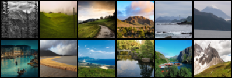
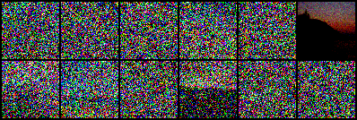

# ddpm
Create environment:
```
conda env create -f environment.yaml
conda activate ddpm
```

Download the [Landscape Dataset](https://www.kaggle.com/datasets/utkarshsaxenadn/landscape-recognition-image-dataset-12k-images) from Kaggle. For convenience I put in blobby

```
$ blobby s3 cp s3://Qixin_Selected_for_FlowAnalysis/Datasets/archive.zip 
$ mkdir landscape_img_folder/train
$ unzip archive.zip -d unzip landscape_img_folder/train/
```

Then run:
```
$ python ddpm.py
```

<a id="Reconstruction-table"></a>
<table>
<caption style="caption-side:bottom"> Table: Noising process for iterations randomly sampled from [0,1000] </caption>
  <tr>
    <td align="center"> Original </td>
    <td align="center"> Noised </td>
  </tr>
  <tr>
    <td>  </td>
    <td>  </td>
  </tr>
</table>


References:
[1] Started the code based on outlier's [[github](https://github.com/dome272/Diffusion-Models-pytorch)]

[2] Also used his youtube tutorial [[Diffusion Models | Pytorch Implementation](https://www.youtube.com/watch?v=TBCRlnwJtZU)]