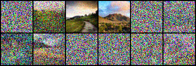

# ddpm
Create environment:
```
conda env create -f environment.yaml
conda activate ddpm
```

Download the [Landscape Dataset](https://www.kaggle.com/datasets/utkarshsaxenadn/landscape-recognition-image-dataset-12k-images) from Kaggle as archive.zip.

```
$ mkdir -p landscape_img_folder/train
$ unzip archive.zip -d landscape_img_folder/train/
```

For my convenience I set up the buckets and download datasets, checkpoints etc. by running:
```
source ./setup.sh
```

## Training
Use multi-GPU training script using <a href="https://huggingface.co/docs/accelerate/">🤗 Accelerate </a>.
```
accelerate launch ddpm_accelerate.py
```
**Note:** Running the same script as `python ddpm_acclerate.py` will fall back to single GPU mode (no effect of _accelerate_). Therefore, the same script can be directly used for single GPU tasks like sampling/inference or debugging. So I decided to retire the single GPU script `ddpm.py`.


### Details and Illustrations on Training
In training, U-Net is trained to estimate the noise (i.e. the mean of the noising process) from the noised samples $q(\mathbf{x}_t|\mathbf{x}_0)$ which are given by normal distribution:

$$q(\mathbf{x}_t|\mathbf{x}_0) = \mathcal{N}(\mathbf{x}_t; \sqrt{\bar{\alpha} _t} \mathbf{x}_0, (1-\bar{\alpha}_t) \mathbf{I} )$$

using a linear $\beta_t$ schedule where $\alpha_t= 1-\beta_t$  and $\bar{\alpha}_t = \Pi _{s=1}^t \alpha_s$. For ex. in the code $\beta_t$ is selected as a linear schedule $[0.0001, 0.02]$. For given $\beta_t$ schedule and large  $t \in [0,1000]$, the $q(\mathbf{x}_t|\mathbf{x}_0)$ becomes zero mean, unit variance normal distribution (as illustrated below).


<!--
Due to bug: https://stackoverflow.com/questions/78158848/how-to-render-both-of-latex-formula-and-image-in-markdown-table-in-github-readme
-->
- **Noised samples   :** $q(\mathbf{x}_t |\mathbf{x}_0)$
- **Original samples :** $q(\mathbf{x}_0)$


|   Noised samples  |      Original  |
|:-----------------------------------------:|:------------------------------------------:|
|       |    |
<!--|        |     |  -->

Table: For batch B=12, it illustrates the noising process for $t=[962, 237,  38,  39, 988, 559, 299, 226, 985, 791, 859, 485]$


<!--
<a id="Reconstruction-table"></a>
<table>
<caption style="caption-side:bottom"> Table: For batch=12, noising process for t=[962, 237,  38,  39, 988, 559, 299, 226, 985, 791, 859, 485] random iterations $$t \in [0,1000]$$ </caption>
  <tr>
    <td align="center"> Original </td>
    <td align="center"> Noised </td>
  </tr>
  <tr>
    <td>  </td>
    <td>  </td>
  </tr>
</table>
-->

</br>
</br>
</br>

## Sampling
Also trained it for the `celeba` dataset. Download two example checkpoints (epoch 30, 80, 490) from the bucket (or `/ddpm/models_celeba/`). Then sample from these two checkpoints (saved as models/ckpt_epoch[30, 80, 490]_ddpm.pt):
```
python ddpm_accelerate.py --ckpt /mnt/task_runtime/ddpm/models/ckpt_epoch490.pt --ckpt_sampling
```
<figure>
<figcaption>Epoch 80 ckpt</figcaption>

</figure>

<figure>
<figcaption>Epoch 300 ckpt</figcaption>

</figure>


Generated the gif by ``ffmpeg -framerate 5  -i results/denoised/denoised_%3d.jpg ddpm_slow.gif``

## References:
[1] Started the code based on outlier's "Diffusion-Models-pytorch" repo on [github](https://github.com/dome272/Diffusion-Models-pytorch).

[2] Also used his youtube tutorial [[Diffusion Models | Pytorch Implementation](https://www.youtube.com/watch?v=TBCRlnwJtZU)].
